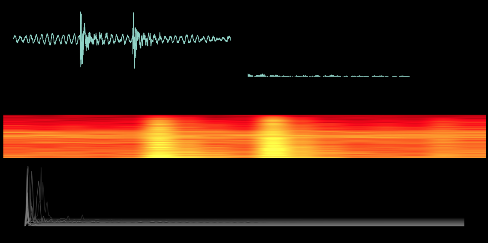

# SoundViz

## How
#### create a new conda environment
`conda env create -n soundViz -f environment.yml `
### activate the newly created environment
`conda activate soundViz`
### run soundViz
`python soundViz.py`

## Preview

